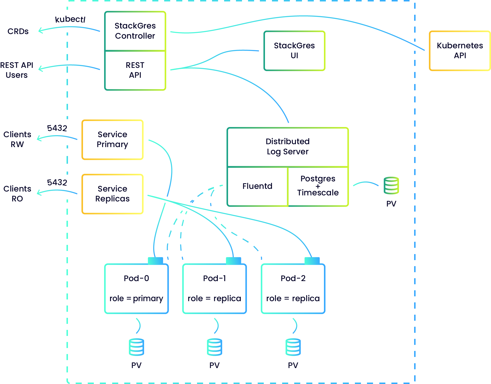

## The Operator

An Operator is a method of packaging, deploying, and managing a Kubernetes
application. Some applications, such as databases, required more hand-holding, and a cloud-native
Postgres requires an operator to provide additional knowledge of how to maintain state and integrate
all the components. The StackGres operator allow to deploy a StackGres cluster using a few custom
resources created by the user.

## Operator Availability Concerns

Operator availability only affect the operational plane. The data plane is not affected
 at all and the databases will work as expected even when the operator is offline.
 The operator is kept available in a best-effort manner. If at some point the operator becomes
 unavailable, this can lead to unavailability of following operational aspects:

* Cluster creation / update
* Cluster configuration creation / update / deletion
* Backups generation
* Reconciliation of modified resources controlled by the operator (when
 modified by the user or some other means)

The availability of the operator does not affect the following functional aspects:

* Database high availability
* Connection pooling
* Incremental backups
* Stats collection

## The Cluster

A StackGres cluster is basically a StatefulSet where each pod is a database instance. The
 StatefulSet guarantees that each pod is always bound to its own persistent volume. Therefore, the
 database instance data will be mapped to the state of a Patroni instance inside kubernetes.

### StackGres Cluster Architecture diagram

### StackGres Pod Architecture diagram

We use a pattern called sidecar where a main application runs in a container and other containers co-located in the same pod
 are providing side functionalities like connection pooling, export of stats, edge proxying,
 logging dispatcher or database utilities.
 

> **UDS:** [Unix Domain Socket](https://en.wikipedia.org/wiki/Unix_domain_socket)

