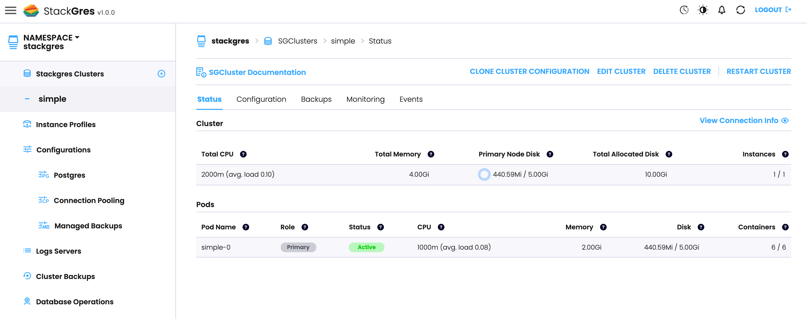

### Chapter 3

# Getting Started

On this page, you will learn how to get started with StackGres.
We will install StackGres on a Kubernetes cluster and create a Postgres instance.

> **NOTE:** To run this demo you need a [K8s environment]({}) that is already configured in `kubectl`.

## Installing the Operator

We ship some Kubernetes resources files in order to allow installation of the StackGres operator
 for demonstration purpose. Assuming you have already installed the
 [kubectl CLI](https://kubernetes.io/docs/tasks/tools/install-kubectl/), you can install the
 operator with the following command:

```
kubectl create -f /stackgres-operator-demo.yml
```

This will install all required resources, and add the StackGres operator to a new namespace `stackgres`.

> The `stackgres-operator-demo.yml` will expose the UI with a LoadBalancer. Note that using this feature
> might cause additional cost by your hosting provider (for example, this is the case for EKS, GKE, and AKS).

## Waiting for Operator Startup

Use the command below to wait until the operator is ready to use:

```
kubectl wait -n stackgres deployment -l group=stackgres.io --for=condition=Available
```

Once it's ready, you will see that the operator pods are `Running`:

```
$ kubectl get pods -n stackgres -l group=stackgres.io
NAME                                  READY   STATUS    RESTARTS   AGE
stackgres-operator-78d57d4f55-pm8r2   1/1     Running   0          3m34s
stackgres-restapi-6ffd694fd5-hcpgp    2/2     Running   0          3m30s

```

## Creating the Cluster

To create your first StackGres cluster, you have to create a simple custom resource that contains the cluster configuration.
The following command does this using the command line:

```
cat << 'EOF' | kubectl create -f -
apiVersion: stackgres.io/v1
kind: SGCluster
metadata:
  name: simple
spec:
  instances: 1
  postgres:
    version: 'latest'
  pods:
    persistentVolume: 
      size: '5Gi'
EOF
```

This will create a cluster using the latest PostgreSQL version with 1 node, with a disk of 5Gi using the default storage class.
It uses StackGres' default configuration for PostgreSQL, connection pooling, and resource profile.

## Verifying the Created Cluster

A cluster called `simple` will be deployed in the default namespace that is configured in your environment (normally this is the namespace `default`).

Follow the creation status:

```
kubectl get pods --watch
```

Eventually, you should see something like this:

```
NAME       READY   STATUS    RESTARTS   AGE
simple-0   6/6     Running   0          2m50s
```

## Accessing Postgres via psql

To open a `psql` console and manage the PostgreSQL cluster, you may connect to the `postgres-util` container of the primary instance (the pod with the label `role: master`).
In this quickstart, we only have a single pod, which name you could simply provide, however the following command works regardless of how many instances you have:

```
kubectl exec -ti "$(kubectl get pod --selector app=StackGresCluster,stackgres.io/cluster=true,role=master -o name)" -c postgres-util -- psql
```

> **Note:** Connecting directly through the `postgres-util` sidecar will grant you access with the postgres user. It works similar to `sudo -i postgres -c psql`.

Please read about the [postgres-util side car]({}) and [how to connect to the Postgres cluster]({}) for more details.


## Accessing Postgres via Kubernetes Services

While accessing the cluster via `psql` is a good quick test, an application typically connects to our instances using the Kubernetes services.
For this, the access needs to be authenticated, which we can do ourselves by adding dedicated Postgres users, or, for this quickstart, by using the `postgres` user (superuser in Postgres).
The password for the `postgres` user is generated randomly when the cluster is created.
You can retrieve it from a secret, named as the cluster, by obtaining the key `"superuser-password"`:

```
kubectl get secret simple --template '{{ printf "%s" (index .data "superuser-password" | base64decode) }}'
```

Now we can authenticate using the user `postgres` and the password that was just returned.
For this, we can already use an application, or, for testing purposes, use `psql` again but from a different container that connects to Postgres via the Kubernetes service names:

```
kubectl run psql --rm -it --image ongres/postgres-util --restart=Never -- psql -h simple postgres postgres
```

This time, the `psql` command will ask for a password, which is the superuser password.


## Connecting to the UI

Now that you know a little more about StackGres, you can easily manage all your clusters from the UI.
The UI will ask for a username and a password.
By default, those are `admin` and a randomly generated password.
You can run the command below to get the user and auto-generated password:

```
kubectl get secret -n stackgres stackgres-restapi --template '{{ printf "username = %s\npassword = %s\n" (.data.k8sUsername | base64decode) ( .data.clearPassword | base64decode) }}'
```

With the credentials in hand, let's connect to the operator web UI. For this, you may forward the HTTPS port of the operator pod:

```
POD_NAME=$(kubectl get pods --namespace stackgres -l "app=stackgres-restapi" -o jsonpath="{.items[0].metadata.name}")
kubectl port-forward "$POD_NAME" 8443:9443 --namespace stackgres
```

Then you can open the browser at the following address [`localhost:8443/admin/`](https://localhost:8443/admin/)




## Cleaning up

To uninstall all resources generated by this demo, you can run:
```
kubectl delete --ignore-not-found -f /stackgres-operator-demo.yml
```

Check the [uninstall]({}) section for more details.

Also, see the [installation via helm]({}) section in order to change those.
