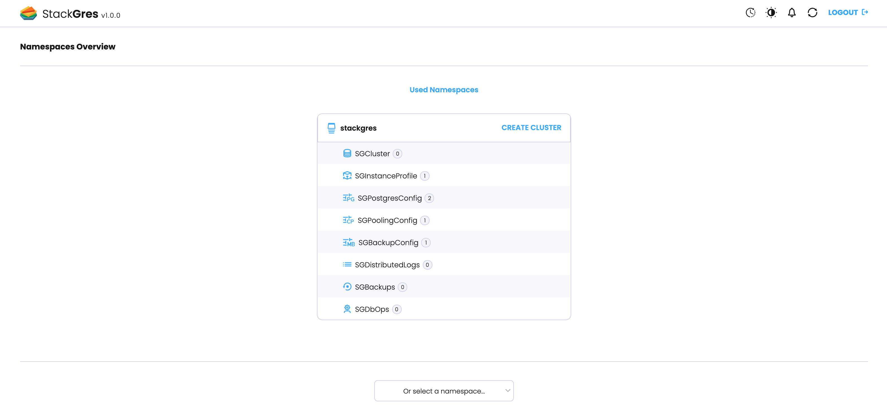

StackGres (the operator and associated components) may be installed on any namespace. It is recommended to create a dedicated namespace for StackGres:

```bash
kubectl create namespace stackgres
```

StackGres recommended installation is performed from the published Helm chart. Some parameters may be passed to the default installation, which basically can be summarized as:
* Username and password to access Grafana (this is used by StackGres to install StackGres specific dashboards as well as to embed Grafana into the Web Console). If you installed Prometheus following the previous step, they will be at their default values (username: `admin`, password: `prom-operator`). Also the Grafana host where it is running (by default, exposed as a service at `prometheus-grafana.namespace`, i.e. `prometheus-grafana.monitoring` here).
* How to expose the Web Console. Select `LoadBalancer` if using a cloud Kubernetes cluster or your Kubernetes environment supports creating load balancers. Otherwise, select `ClusterIP` (in this case you will later need to do a port forward to access the Web Console).

Proceed to install StackGres:

- Add the helm repo:

```
helm repo add stackgres-charts https://stackgres.io/downloads/stackgres-k8s/stackgres/helm/
```

- Install the Operator

```bash
helm install --namespace stackgres stackgres-operator \
    --version 1.0.0 \
    --set grafana.autoEmbed=true \
    --set-string grafana.webHost=prometheus-operator-grafana.monitoring \
    --set-string grafana.secretNamespace=monitoring \
    --set-string grafana.secretName=prometheus-operator-grafana \
    --set-string grafana.secretUserKey=admin-user \
    --set-string grafana.secretPasswordKey=admin-password \
    --set-string adminui.service.type=LoadBalancer \
stackgres-charts/stackgres-operator
```

Note that using `adminui.service.type=LoadBalancer` will create a network load balancer, which may incur in additional costs. You may alternatively use `ClusterIP` if that's your preference.

StackGres installation may take a few minutes. The output will be similar to:

```plain
NAME: stackgres-operator
LAST DEPLOYED: Mon Oct 1 00:25:10 2021
NAMESPACE: stackgres
STATUS: deployed
REVISION: 1
TEST SUITE: None
NOTES:
Release Name: stackgres-operator
StackGres Version: 1.0.0

   _____ _             _     _____
  / ____| |           | |   / ____|
 | (___ | |_ __ _  ___| | _| |  __ _ __ ___  ___
  \___ \| __/ _` |/ __| |/ / | |_ | '__/ _ \/ __|
  ____) | || (_| | (__|   <| |__| | | |  __/\__ \
 |_____/ \__\__,_|\___|_|\_\\_____|_|  \___||___/
                                  by OnGres, Inc.

Check if the operator was successfully deployed and is available:

    kubectl describe deployment -n stackgres stackgres-operator

    kubectl wait -n stackgres deployment/stackgres-operator --for condition=Available

Check if the restapi was successfully deployed and is available:

    kubectl describe deployment -n stackgres stackgres-restapi

    kubectl wait -n stackgres deployment/stackgres-restapi --for condition=Available

To access StackGres Operator UI from localhost, run the below commands:

    POD_NAME=$(kubectl get pods --namespace stackgres -l "app=stackgres-restapi" -o jsonpath="{.items[0].metadata.name}")

    kubectl port-forward "$POD_NAME" 8443:9443 --namespace stackgres

Read more about port forwarding here: http://kubernetes.io/docs/user-guide/kubectl/kubectl_port-forward/

Now you can access the StackGres Operator UI on:

https://localhost:8443

To get the username, run the command:

    kubectl get secret -n stackgres stackgres-restapi --template '{{ printf "username = %s\n" (.data.k8sUsername | base64decode) }}'

To get the generated password, run the command:

    kubectl get secret -n stackgres stackgres-restapi --template '{{ printf "password = %s\n" (.data.clearPassword | base64decode) }}'

Remember to remove the generated password hint from the secret to avoid security flaws:

    kubectl patch secrets --namespace stackgres stackgres-restapi --type json -p '[{"op":"remove","path":"/data/clearPassword"}]'
```


## Connecting to the Web Console

Several useful commands are provided as part of the Helm installation output. Let's use them to connect to the StackGres
Web Console. If the `LoadBalancer` parameter was used, let's query the URL of the created load balancer, by querying the
K8s Service created:

```bash
kubectl -n stackgres get svc --field-selector metadata.name=stackgres-restapi

NAME                TYPE           CLUSTER-IP      EXTERNAL-IP                                                              PORT(S)         AGE
stackgres-restapi   LoadBalancer   10.100.165.13   aa372eefc1630469f95e64d384caa004-833850176.eu-west-1.elb.amazonaws.com   443:32194/TCP   47m
```

The Web Console is exposed as part of the `stackgres-restapi` service. Here we can see it is of type `LoadBalancer`, and exposed at a given URL. Open this URL in the web browser prefixing it with `https://` , as in:

```
https://aa372eefc1630469f95e64d384caa004-833850176.eu-west-1.elb.amazonaws.com
```

If your service is exposed as `ClusterIP`, you can instead use port forwarding to access the Web Console. Find the name of the `restapi` pod in either of the following ways, at your preference:

```bash
$ POD_NAME=$(kubectl get pods --namespace stackgres -l "app=stackgres-restapi" -o jsonpath="{.items[0].metadata.name}")
```

And then do the port-forward to your localhost on port 8443, which you can access from the web browser on URL `https://localhost:8443`:

```bash
$ kubectl port-forward "$POD_NAME" 8443:9443 --namespace stackgres
```

Once you open the Web Console in the browser, you will need to accept to continue to the page. StackGres Web Console uses by default a self-signed certificate, which is generated during the installation. You can customize it during the installation, or install the Web Console only via HTTP and expose it via an _Ingress_ controller. But for now, proceed. The default administrator's username is `admin`, and the password is generated automatically but can be obtained via the following command:

```bash
$ kubectl get secret -n stackgres stackgres-restapi --template '{{ printf "%s\n" (.data.clearPassword | base64decode) }}'
```

You should see something like the following screenshot (where Dark Mode was activated!):




