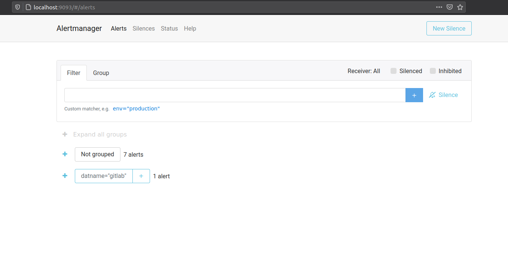
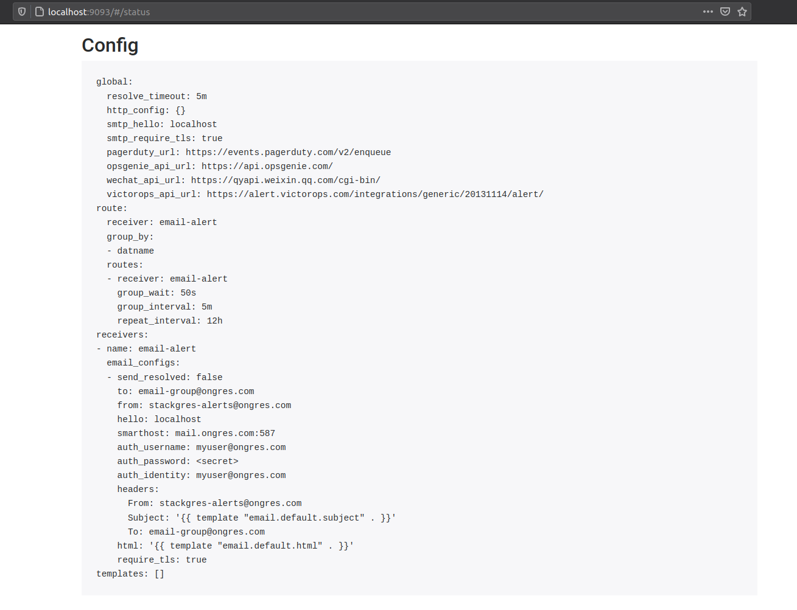
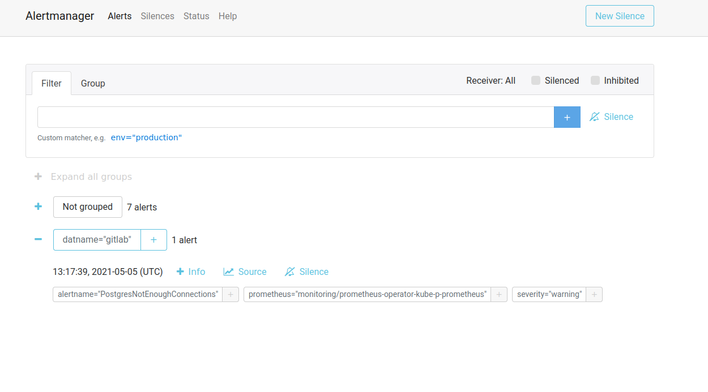
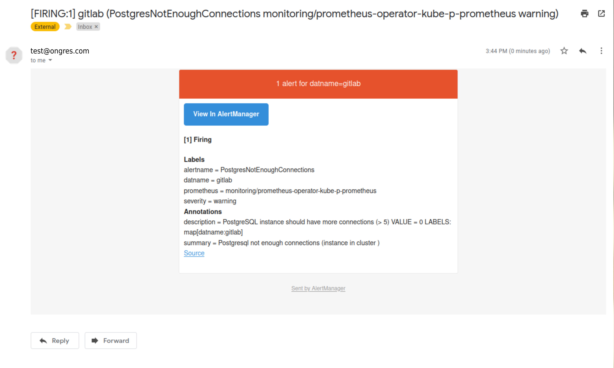

This runbook will show you how to add Postgres alerts to your Prometheus installation and give you some usefull ones.

## Environment

This runbook will show you to add postgres alerts using a default Prometheus installation with [kube-prometheus-stack](https://github.com/prometheus-community/helm-charts/tree/main/charts/kube-prometheus-stack). In case you still haven't a Prometheus installation follow the steps in the [StackGres tutorial]({}).

The Prometheus installation will add to your K8s cluster some CRS's:

```
$ kubectl get crd -o name | grep monitoring
customresourcedefinition.apiextensions.k8s.io/alertmanagerconfigs.monitoring.coreos.com
customresourcedefinition.apiextensions.k8s.io/alertmanagers.monitoring.coreos.com
customresourcedefinition.apiextensions.k8s.io/podmonitors.monitoring.coreos.com
customresourcedefinition.apiextensions.k8s.io/probes.monitoring.coreos.com
customresourcedefinition.apiextensions.k8s.io/prometheuses.monitoring.coreos.com
customresourcedefinition.apiextensions.k8s.io/prometheusrules.monitoring.coreos.com
customresourcedefinition.apiextensions.k8s.io/servicemonitors.monitoring.coreos.com
customresourcedefinition.apiextensions.k8s.io/thanosrulers.monitoring.coreos.com
```

## Defining your alerts

The Prometheus resources allow you to add Prometheus instances and Prometheus rules. The prometheus rules are the resources to define your alerts using `promql` with some other required parameters. This is and example of a postgres rule:

```
- alert: PostgresInstanceDown
      expr: pg_up == 0
      for: 1m
      labels:
        severity: critical
        service: "PostgreSQL"
      annotations:
        summary: "Postgres server instance is down"
        description: "Postgres has not been responding for the past 1 minutes on {{ $labels.instance }}"
        title: "Postgres server instance {{ $labels.instance }} is down "
```

The `expr` parameter is the prometheus query to retreive the data for the alert in this example `pg_up` metric return `0` is the instance is down and `1` if up. The `for` parameter is the threshold time to evaluate the query. Then you can also add labels and annotations to describe more precisely your alert. So the above example means `If the pg_up metric value is equal to zero for 1m then fire the alert`. Check the alerts section below for the full alerts description and the `yaml` file definition.

## Alerts

These are some useful alerts you can add to your StackGres cluster.

| Alert                                    | Severity | Threshod | Description                                                     |
|------------------------------------------|----------|----------|-----------------------------------------------------------------|
| PostgresExporterErrors                   | critical |   5m     | Check the last scrape from postgres-exporter                    |
| PostgresInstanceDown                     | critical |   1m     | Check is postgres service is up                                 |
| PostgresSplitBrain                       | critical |   1m     | Check if is more than one Read/Write instance on the cluster    |
| PostgresPromotedNode                     | critical |   5m     | Check if the replication leader was changed                     |
| PostgresInactiveReplicationSlots         | warning  |   30m    | Check if there is a inactive replication slot                   |
| PostgresReplicationLagSizeTooLarge       | warning  |   5m     | Check if the replication lag is increasing                      |
| PostgresTooManyDeadTuples                | warning  |   30m    | Check if there are to many dead tuples                          |
| PostgresTooManyConnections               | warning  |   5m     | Check if postgres connections are above 90% of max_connections  |
| PostgresNotEnoughConnections             | warning  |   5m     | Check if postgres available connections are less than 5         |
| PgBouncerWaitingClients                  | crititcal|   1m     | Check if pgbouncer has waiting clients                          |
| PgBouncerNotEnoughConnections            | critical |   5m     | Check if pool size is not enough for the current connections    |
| PgBouncerPoolFillingUp                   | warning  |   5m     | Check if pgBouncer pool is filling up                           |
| PgBouncerAvgWaitTimeTooHigh              | warning  |   5m     | Check if time spent by clients waiting for a connections > 1s   |
| PgBouncerQueryTimeTooHigh                | warning  |   5m     | Check if average query duration more than 5 seconds             |
| DatabaseLowDiskAvailable                 | warning  |   15m    | Check the database available disk size <= 20%                   |


With the default Prometheus stack installation use the next yaml description to create a file `stackgres-alerts.yaml`:


```
apiVersion: monitoring.coreos.com/v1
kind: PrometheusRule
metadata:
  labels:
    app: kube-prometheus-stack
    release: prometheus-operator
  name: stackgres-rules
  namespace: monitoring
spec:
  groups:
  - name: StackGres
    rules:
    - alert: PostgresInstanceDown
      expr: pg_up == 0
      for: 1m
      labels:
        severity: critical
        service: "PostgreSQL"
      annotations:
        summary: "Postgres server instance is down"
        description: "Postgres has not been responding for the past 1 minutes on {{ $labels.instance }}"
        title: "Postgres server instance {{ $labels.instance }} is down "
    - alert: PostgresExporterErrors
      expr: pg_exporter_last_scrape_error == 1
      for: 10m
      labels:
        severity: critical
        service: "PostgreSQL"
      annotations:
        summary: "Postgres Exporter is down or is showing errors"
        description: "postgres-exporter is not running or it is showing errors {{ $labels.instance }}"
    - alert: PostgresReplicationLagSizeTooLarge
      expr: pg_replication_status_lag_size > 1e+09
      for: 5m
      labels:
        severity: critical
        service: "PostgreSQL"
      annotations:
        summary: "Postgres replication lag size is to large"
        description: "Replication lag size on server {{$labels.instance}} ({{$labels.application_name}}) is currently {{ $value | humanize1024}}B behind the leader in cluster {{$labels.cluster_name}}"
    - alert: PostgresTooManyDeadTuples
      expr: ((pg_stat_user_tables_n_dead_tup > 1e+06) / (pg_stat_user_tables_n_live_tup + pg_stat_user_tables_n_dead_tup)) >= 0.05
      for: 30m
      labels:
        severity: warning
        service: "PostgreSQL"
      annotations:
        summary: "PostgreSQL dead tuples is too large"
        description: "The dead tuple ratio of {{$labels.relname}} on database {{$labels.datname}} is greater than 5% in cluster {{$labels.cluster_name}}"
    - alert: PostgresInactiveReplicationSlots
      expr: pg_replication_slots_active == 0
      for: 30m
      labels:
        severity: warning
        service: "PostgreSQL"
      annotations:
        summary: "There are inactive replications slots"
        description: "The are some inactive replication slots on {{$labels.instance}} in cluster {{$labels.cluster_name}}"
    - alert: PostgresSplitBrain
      expr: count by(cluster_name) (pg_replication_is_replica == 0) > 1
      for: 1m
      labels:
        severity: critical
        service: "PostgreSQL"
      annotations:
        summary: "There are more than one instance in read-write mode"
        description: "Split Brain: too many postgres databases in cluster {{$labels.cluster_name}} in read-write mode"
    - alert: PostgresTooManyConnections
      expr: sum by (datname) (pg_stat_activity_count{datname!~"template.*|postgres"}) > pg_settings_max_connections * 0.9
      for: 5m
      labels:
        severity: warning
      annotations:
        summary: Postgresql too many connections (instance {{ $labels.instance }} in cluster {{$labels.cluster_name}})
        description: "PostgreSQL instance has too many connections\n  VALUE = {{ $value }}\n  LABELS: {{ $labels }}"
    - alert: PostgresNotEnoughConnections
      expr: sum by (datname) (pg_stat_activity_count{datname!~"template.*|postgres"}) < 5
      for: 5m
      labels:
        severity: warning
      annotations:
        summary: Postgresql not enough connections (instance {{ $labels.instance }} in cluster {{$labels.cluster_name}})
        description: "PostgreSQL instance should have more connections (> 5)\n  VALUE = {{ $value }}\n  LABELS: {{ $labels }}"
    - alert: PostgresPromotedNode
      expr: pg_replication_is_replica and changes(pg_replication_is_replica[1m]) > 0
      for: 5m
      labels:
        severity: warning
      annotations:
        summary: "Postgresql promoted node (instance {{ $labels.instance }}, cluster {{ $labels.cluster_name }})"
        description: "Postgresql standby server has been promoted as primary node\n  VALUE = {{ $value }}\n  LABELS: {{ $labels }}"
    # Connection Pooling alerts
    - alert: PgBouncerWaitingClients
      expr: pgbouncer_show_pools_cl_waiting > 0
      for: 5m
      labels:
        severity: warning
      annotations:
        summary: PgBouncer has waiting clients on instance {{ $labels.instance }} in cluster {{$labels.cluster_name}})
        description: "PgBouncer instance has waiting clients\n  VALUE = {{ $value }}\n  LABELS: {{ $labels }}"
    - alert: PgBouncerNotEnoughConnections
      expr: (sum by (database,instance) (pgbouncer_show_pools_cl_active{database!~"template.*|postgres|pgbouncer"}) + sum by (database, instance) (pgbouncer_show_pools_cl_waiting{database!~"template.*|postgres|pgbouncer"}))  - on (database,instance) (pgbouncer_show_databases_pool_size{database!~"template.*|postgres|pgbouncer"}) > 0
      for: 10m
      labels:
        severity: critical
      annotations:
        summary: PgBouncer pool size is not enough for the current connections on {{ $labels.instance }} in cluster {{$labels.cluster_name}})
        description: "PgBouncer is getting more connections than the pool size, extra connections = {{ $value }}"
    - alert: PgBouncerPoolFillingUp
      expr: (sum by (database,instance) (pgbouncer_show_databases_pool_size{database!~"template.*|postgres|pgbouncer"})  - on (database,instance) pgbouncer_show_databases_current_connections)  <= 15
      for: 5m
      labels:
        severity: warning
      annotations:
        summary: PgBouncer pool is filling up on {{ $labels.instance }} in cluster {{$labels.cluster_name}})
        description: "PgBouncer pool is filling up, remaining connections = {{ $value }}"
    - alert: PgBouncerAvgWaitTimeTooHigh
      expr: pgbouncer_show_stats_avg_wait_time > 1e+6
      for: 5m
      labels:
        severity: warning
      annotations:
        summary: PgBouncer time spent by clients waiting for a connections is too high on {{ $labels.instance }} in cluster {{$labels.cluster_name}})
        description: "PgBouncer wait for a server connections is too high = {{ $value }}"
    - alert: PgBouncerQueryTimeTooHigh
      expr: pgbouncer_show_stats_avg_query_time > 5e+6
      for: 5m
      labels:
        severity: warning
      annotations:
        summary: PgBouncer average query duration more than 5 seconds on {{ $labels.instance }} in cluster {{$labels.cluster_name}})
        description: "PgBouncer average query duration more than 5 seconds = {{ $value }}"
    - alert: DatabaseLowDiskAvailable
      expr: (1.0 - node_filesystem_avail_bytes{mountpoint="/var/lib/postgresql",fstype!=""} / node_filesystem_size_bytes{mountpoint="/var/lib/postgresql",fstype!=""}) * 100 >= 80
      for: 15m
      labels:
        severity: warning
      annotations:
        summary: Database disk is filling up currently have less than 20% available on {{ $labels.instance }} in cluster {{$labels.cluster_name}})
        description: "Database disk is filling up currently have less than 20%, currently occupied {{ $value }} %"

```

and deploy it to kubernetes:

```
kubectl apply -f stackgres-alerts.yaml
```


## How Prometheus discover the alerts

With the default prometheus installation some deployment will be added:

```
$ kubectl get deployments.apps -n monitoring
NAME                                     READY   UP-TO-DATE   AVAILABLE   AGE
prometheus-operator-grafana              1/1     1            1           25d
prometheus-operator-kube-p-operator      1/1     1            1           25d
prometheus-operator-kube-state-metrics   1/1     1            1           25d
```

This will create a Prometheus instance:

```
$ kubectl get pods -n monitoring -l app=prometheus
NAME                                                 READY   STATUS    RESTARTS   AGE
prometheus-prometheus-operator-kube-p-prometheus-0   2/2     Running   0          25d
```

This instance has defined a `ruleSelector` section with some labels:

```
$ kubectl get -n monitoring prometheus prometheus-operator-kube-p-prometheus -o yaml | grep -A3 ruleSelector
  ruleSelector:
    matchLabels:
      app: kube-prometheus-stack
      release: prometheus-operator
```


You need to make sure the `metadata` labels from your `Prometheus Rule` match with the `ruleSelector` labels of your prometheus instance. In this case will be as is shown below:

```
apiVersion: monitoring.coreos.com/v1
kind: PrometheusRule
metadata:
  labels:
    app: kube-prometheus-stack
    release: prometheus-operator
  name: stackgres-rules
  namespace: monitoring
  ...
  ...
  ```

Prometheus will autodiscover the alerts according to the matching lables and add them to the instance:


## Email alerts with AlertManager

Once you have configured the alerts on Prometheus, depending on your infrastructure you can create push messages in an alert is fire. You could use, email, [Slack](https://slack.com/), [Pagerduty](https://www.pagerduty.com/), [Opsgenie](https://www.atlassian.com/software/opsgenie) and others. Check [Alert Manager Configuration](https://prometheus.io/docs/alerting/latest/configuration/) for more details. In this example you'll see how to configure alerts with email messages.

The Prometheus stack installation include an installation of AlertManager:

```
$ kubectl get pods -n monitoring -l app=alertmanager
NAME                                                     READY   STATUS    RESTARTS   AGE
alertmanager-prometheus-operator-kube-p-alertmanager-0   2/2     Running   0          68m
```

The alerting configuration is added using a secret::

```
$ kubectl get secrets -n monitoring alertmanager-prometheus-operator-kube-p-alertmanager
NAME                                                   TYPE     DATA   AGE
alertmanager-prometheus-operator-kube-p-alertmanager   Opaque   1      30d
```

To update the configuration you need to first create a `yml` file `alertmanager.yaml` with the next content(Replace the users and credentials with your settings):

```
global:
  resolve_timeout: 5m
route:
  receiver: 'email-alert'
  group_by: ['datname']

  routes:
  - receiver: 'email-alert'
    group_wait: 50s
    group_interval: 5m
    repeat_interval: 12h

receivers:
- name: email-alert
  email_configs:
  - to: email-group@ongres.com
    from: stackgres-alerts@ongres.com
    # Your smtp server address
    smarthost: mail.ongres.com:587
    auth_username: myuser@ongres.com
    auth_identity: myuser@ongres.com
    auth_password: XXXXXXX
```

Next you need to encrypt the content of the file running:

```
$ cat alertmanager.yaml | base64 -w0
```

This will return a string like:

```
Z2xvYmFsOgogIHJlc29sdmVfdGltZW91dDogNW0Kcm91dGU6CiAgcmVjZWl2ZXI6ICdlbWFpbC1hbGVydCcK
```

Edit the alertmanager secret with the string generated with the command above:

```
$ kubectl patch secret -n monitoring alertmanager-prometheus-operator-kube-p-alertmanager -p='{"data":{"alertmanager.yaml": "Z2xvYmFsOgogIHJlc29sdmVfdGltZW91dDogNW0Kcm91dGU6CiAgcmVjZWl2ZXI6ICdlbWFpbC1hbGVydCcK"}}' -v=1
```

After a few seconds, the new configuration will be applied, you can verify it by accessing the AlertManager console, with:

```
kubectl port-forward -n monitoring alertmanager-prometheus-operator-kube-p-alertmanager-0 9093:9093
```

Then open your web browser and type:

```
http://localhost:9093
```





Now go to the `Status` section and verify your changes were applied:




If there's an active alert on your cluster you should see it in the alert manager console:



And if the email configuration and credentials you provide are OK, you'll get the alert message:

